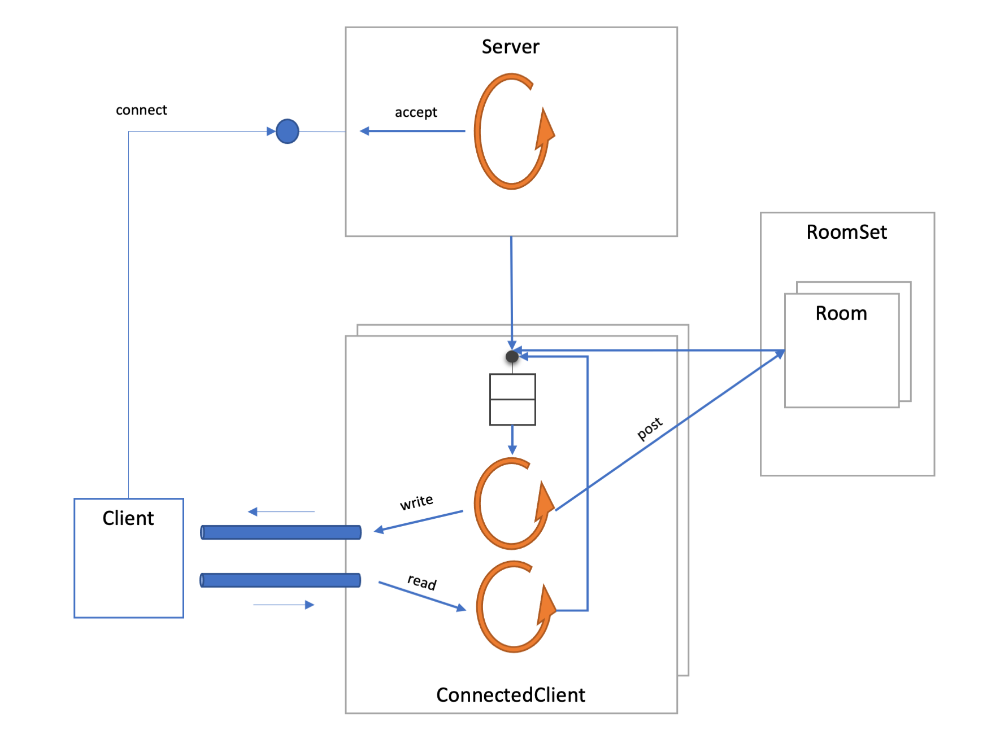

# s2223v-se3

# Base implementation for the Spring 2023 project

This repository contains a _base implementation_ for the Spring 2023 Concurrent Programming project.

* _Base implementation_ means it is not feature complete and may have errors.

* It uses a _threads per connection_, requiring two platform threads per connected client. The main goal of the project is to change this design to mainly use coroutines instead of threads to handle each client connection. 
    
For any question regarding this base implementation, please open an issue at [https://github.com/isel-leic-pc/s2223v-se3/issues](https://github.com/isel-leic-pc/s2223v-se3/issues).
 
Be aware of any commits with corrections or improvements to this base implementation by looking at the project's [commit history](https://github.com/isel-leic-pc/s2223v-se3/commits/main).

## Design aspects

This base implementation uses the following design:

* Each server instance has one thread to listen for new connections and creates a client instance for each.
Most of the time, this thread will be blocked waiting for a new connection.

* Each client instance uses two threads:
    - a _main thread_ that reads and processes control messages from a _control_ queue. These control messages can be:
        - A text message posted to a room where the client is present.
        - A text line sent by the remote connected client.
        - An indication that the read stream from the remote connected client ended.
        - An indication that the handling of the client should end (e.g. because the server is ending).
    - a _read thread_ that reads lines from the remote client connection and transform these into control messages sent to the main thread.
    
* Most interactions with the client are done by sending messages to the client control queue.

